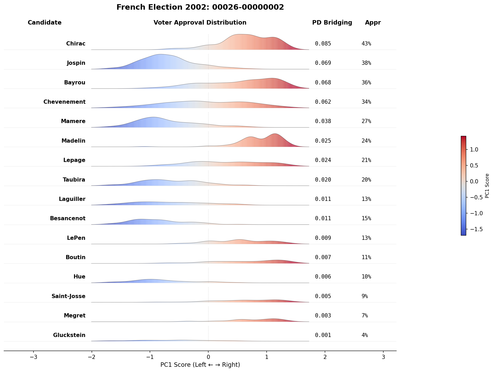
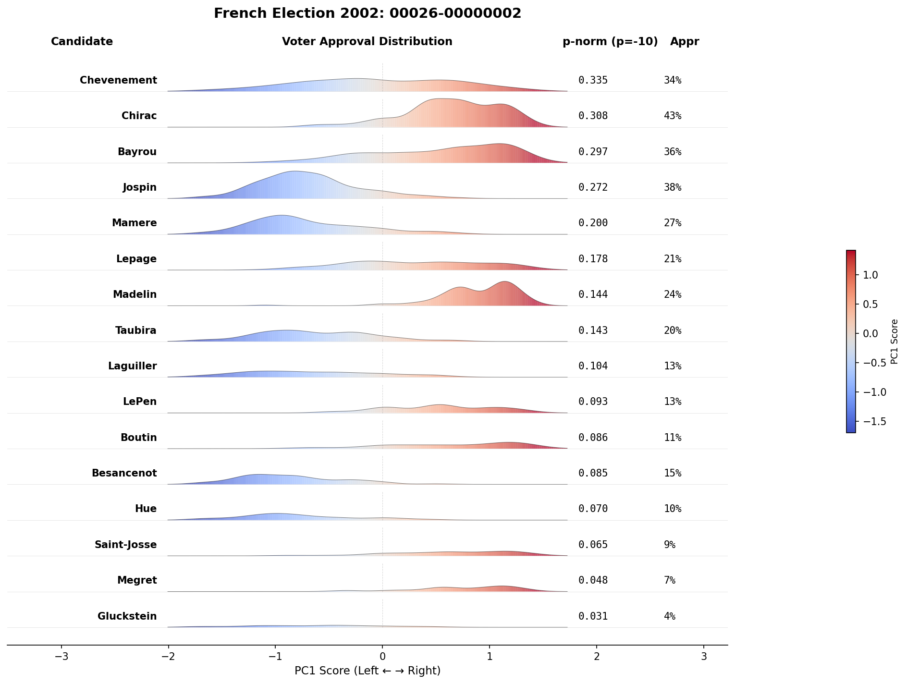
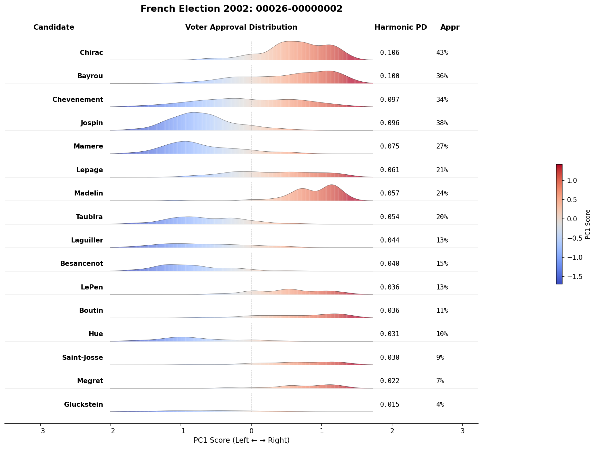
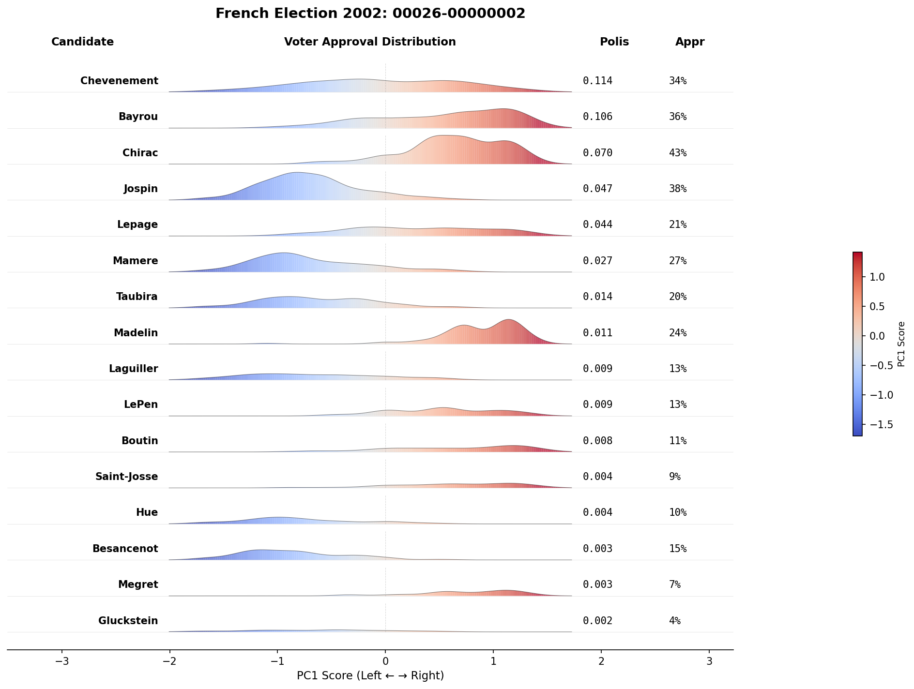

# Experiment 3: Voter PCA Spectrum Visualization

Visualizes which voters (positioned on a political spectrum via PCA) approve each candidate.

## Usage

```bash
python experiment_3/visualize.py              # Ridgeline plots
python experiment_3/visualize.py --histogram  # Histogram plots
```

## Output

Plots are organized by bridging metric:

```
plots/
├── pd_bridging/      # Sorted by PD Bridging score
├── pnorm_min/        # Sorted by p-norm (p=-10, approx min)
├── pnorm_geo/        # Sorted by p-norm (p=0, geometric mean)
├── harmonic_pd/      # Sorted by Harmonic PD
└── polis/            # Sorted by Polis Consensus
```

## Visualization Styles

| Style | Shows |
|-------|-------|
| **Ridgeline** | Density of approvers with blue→red color gradient |
| **Histogram** | Approval rate (blue) vs disapproval (grey) by spectrum position |

## Interpretation

- **Bridging candidates:** Approval spread across entire spectrum
- **Polarizing candidates:** Approval concentrated on one side

## Method

1. Project voters onto PC1 (dominant axis of variation)
2. For each candidate, visualize approval pattern across the spectrum
3. Sort candidates by bridging score (highest at top)
4. Display bridging score and approval rate for each candidate

## Data

| Dataset | Files | Items |
|---------|-------|-------|
| French Election 2002 (00026) | 6 | 16 candidates |
| San Sebastian Poster (00033) | 2 | 17 posters |
| CTU Tutorial (00063) | 1 | 23 time slots |
| French Election 2007 (00071) | 6 | 12 candidates |

## Example: French Election 2002 (00026-00000002)

This polling station has 409 voters choosing among 16 candidates. The ridgeline plots below show how each bridging metric ranks the candidates differently.

### PD Bridging



### p-norm (p=-10, approx min)



### p-norm (p=0, geometric mean)


### Harmonic PD



### Polis Consensus



### Observations

**Chevenement** is the key differentiator between methods. The **p-norm (p=-10)** metric consistently ranks Chevenement #1 across multiple polling stations, while approval-correlated metrics rank him lower:

| Metric | 00026-00000002 | 00026-00000004 | 00026-00000005 |
|--------|----------------|----------------|----------------|
| Approval | Chirac #1, Chev #4 | Jospin #1, Chev #3 | Jospin #1, Chev #2 |
| p-norm (p=-10) | **Chev #1** | **Chev #1** | **Chev #1** |
| Polis | **Chev #1** | **Chev #1** | Jospin #1, Chev #12 |

Looking at the ridgeline plots, Chevenement's approval is spread across the entire political spectrum (both left and right sides show support), while Chirac and Jospin have higher overall approval but more concentrated support patterns.

The **p-norm (p=-10)** metric, which approximates the minimum approval across groups, consistently identifies Chevenement as the most bridging candidate. Polis agrees in 2/3 cases but diverges in 00000005 (where it ranks Chevenement #12). This highlights Polis's sensitivity to clustering.

## Example: French Election 2007 (00071-00000003)

This polling station has 606 voters choosing among 12 candidates.

| Metric | #1 | #2 |
|--------|----|----|
| Approval | Laguiller (54.3%) | Bayrou (52.3%) |
| PD Bridging | **Bayrou** | Laguiller |
| p-norm (p=-10) | **Bayrou** | Laguiller |
| p-norm (p=0) | Laguiller | Bayrou |
| Harmonic PD | **Bayrou** | Laguiller |
| Polis | Laguiller | Royal |

Here, **Bayrou** (the centrist candidate) is ranked #1 by PD Bridging, p-norm (p=-10), and Harmonic PD, despite Laguiller having higher approval (54.3% vs 52.3%). This suggests Bayrou's support is more evenly spread across the political spectrum.

Similarly in **00071-00000006** (547 voters):

| Metric | #1 | #2 |
|--------|----|----|
| Approval | Royal (49.9%) | Bayrou (46.4%) |
| PD Bridging | Royal | Bayrou |
| p-norm (p=-10) | **Bayrou** | Royal |
| p-norm (p=0) | Royal | Bayrou |
| Harmonic PD | Royal | Bayrou |
| Polis | Royal | Laguiller |

Again, **p-norm (p=-10)** picks the centrist Bayrou over the approval leader Royal.
