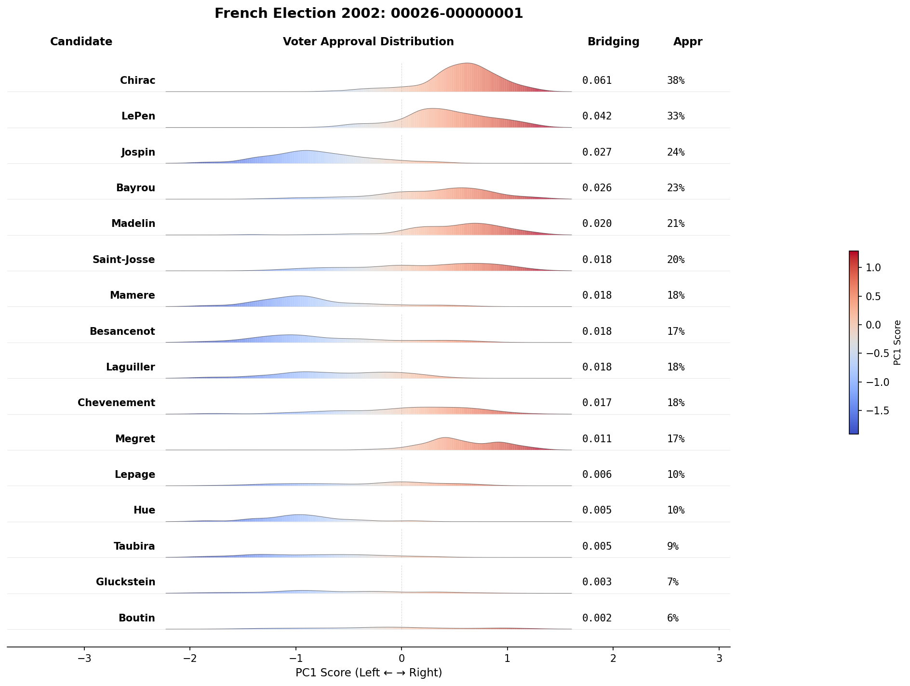
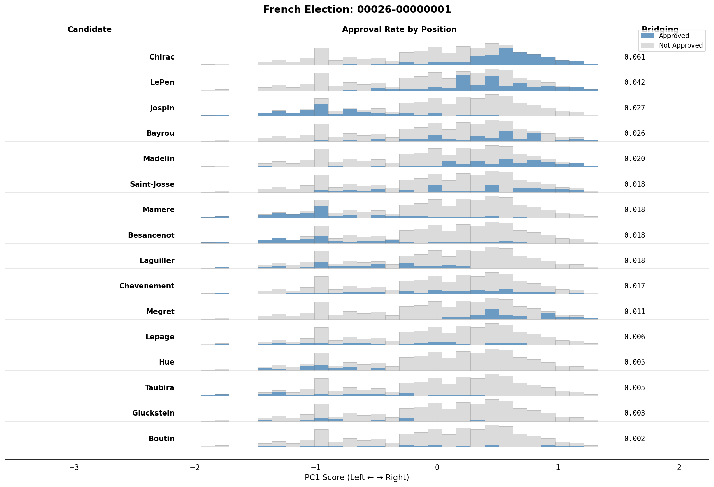

# Bridging Score Experiments

This repository contains experiments on measuring and estimating bridging scores in voting/approval data, with a focus on Pol.is-style deliberation platforms.

## Overview

**Bridging comments** are those approved by voters who otherwise disagree with each other. Identifying such comments is valuable for finding consensus in polarized discussions. These experiments explore:

1. The relationship between approval rates and approver diversity
2. How to estimate bridging scores from partially observed data under informative missingness

## Data

### Sources

- **French Election (00026)**: 6 files from PrefLib, fully observed
- **Pol.is (00069)**: 20 files, originally sparse data completed using matrix completion

### Format

All data stored as `.npz` files with matrix shape `(n_items, n_voters)`:
- `1.0` = approved/agree
- `0.0` = disapproved/disagree
- `NaN` = missing (in processed files only)

### Directories

```
data/
├── processed/preflib/     # Raw processed data (may have NaN)
│   ├── 00026-*.npz        # French election (complete)
│   └── 00069-*.npz        # Pol.is (sparse)
└── completed/             # Matrix-completed data (no NaN)
    └── 00069-*.npz        # Pol.is completed via KNNBaseline
```

---

## Experiment 1: Approval Rate vs. Approver Diversity

**Question:** What is the relationship between how popular an item is and how diverse its supporters are?

### Approach

- **X-axis**: Approver diversity (mean pairwise Hamming distance between approvers' full voting profiles)
- **Y-axis**: Approval rate (fraction who approved)

High diversity + high approval suggests bridging/consensus items.

### Run

```bash
python experiment_1/analyze.py
```

### Output

Scatter plots saved to `experiment_1/plots/hamming_distance/`

See [experiment_1/README.md](experiment_1/README.md) for details.

---

## Experiment 2: Bridging Score Estimation Under Pol.is Sampling

**Question:** Can we accurately estimate bridging scores from partially observed Pol.is data?

### The Problem

Pol.is uses an adaptive routing algorithm that creates **informative missingness**: comments with higher agreement rates and more "extreme" PCA positions are shown more often. This biases naive estimators.

### Approach

1. **Simulate** Pol.is routing on complete (ground truth) data
2. **Track** exact inclusion probabilities for each voter-comment pair
3. **Estimate** bridging scores using Inverse Probability Weighting (IPW)
4. **Compare** IPW estimates to ground truth and naive estimates

### Key Components

- **Bridging Score**: Pairwise disagreement measure with 4/n² normalization
- **Priority Formula**: Faithful recreation of Pol.is routing (Laplace smoothing, PCA extremeness, vote factor)
- **Inclusion Probabilities**: Exact recursive computation (with Monte Carlo fallback for large problems)
- **IPW Estimator**: Corrects for sampling bias using computed probabilities

### Run

```bash
python -m experiment_2.run_experiment
```

### Output

Results saved to `experiment_2/results/` as JSON with:
- Per-dataset metrics (Spearman, Kendall, RMSE, top-k precision/recall)
- Aggregate statistics across all datasets

See [experiment_2/README.md](experiment_2/README.md) for full technical details.

---

## Experiment 3: Voter PCA Spectrum Visualization

**Question:** How are approvals distributed across the political spectrum for each candidate/comment?

### Approach

1. **Position voters** on a 1D spectrum using PCA (PC1 captures dominant axis of variation)
2. **Visualize approval patterns** for each candidate/comment

### Visualizations

Two visualization styles are available:

#### Ridgeline Plot (default)
- **Height** = unnormalized density of approvers (preserves count info)
- **Color gradient** = blue (left) to red (right) based on PC1 position
- Shows both approval volume and distribution shape



#### Histogram Plot (`--histogram`)
- **Bar height** = number of voters in each bin (same for all candidates)
- **Blue portion** = approval rate at that position
- **Grey portion** = disapproval rate
- Shows approval rate across the spectrum



### Run

```bash
# Ridgeline plots
python experiment_3/visualize.py

# Histogram plots
python experiment_3/visualize.py --histogram
```

### Output

- Ridgeline plots: `experiment_3/plots/`
- Histogram plots: `experiment_3/plots_histogram/`

### Interpretation

- **Bridging candidates**: Approval (blue) spread across entire spectrum
- **Polarizing candidates**: Approval concentrated on one side only

See [experiment_3/README.md](experiment_3/README.md) for details.

---

## Project Structure

```
bridging/
├── readme.md                 # This file
├── data/
│   ├── processed/preflib/    # Raw data
│   └── completed/            # Matrix-completed data
├── experiment_1/
│   ├── README.md
│   ├── analyze.py            # Main script
│   └── plots/                # Output plots
├── experiment_2/
│   ├── README.md
│   ├── bridging.py           # Ground truth computation
│   ├── priority.py           # Pol.is priority formula
│   ├── simulation.py         # Routing simulation
│   ├── estimation.py         # IPW estimation
│   ├── evaluate.py           # Metrics
│   ├── run_experiment.py     # Main runner
│   ├── tests/                # Unit & integration tests
│   └── results/              # Output JSON files
└── experiment_3/
    ├── README.md
    ├── visualize.py          # Visualization script
    ├── plots/                # Ridgeline plots
    └── plots_histogram/      # Histogram plots
```

## Requirements

- Python 3.9+
- numpy
- scipy
- matplotlib
- tqdm

## Tests

```bash
# Run all experiment_2 tests
pytest experiment_2/tests/ -v

# Quick tests only
pytest experiment_2/tests/ -v -m "not slow"
```

## References

- [Pol.is source code](https://github.com/compdemocracy/polis)
- Priority formula: `math/src/polismath/math/conversation.clj`
- PCA implementation: `math/src/polismath/math/pca.clj`
